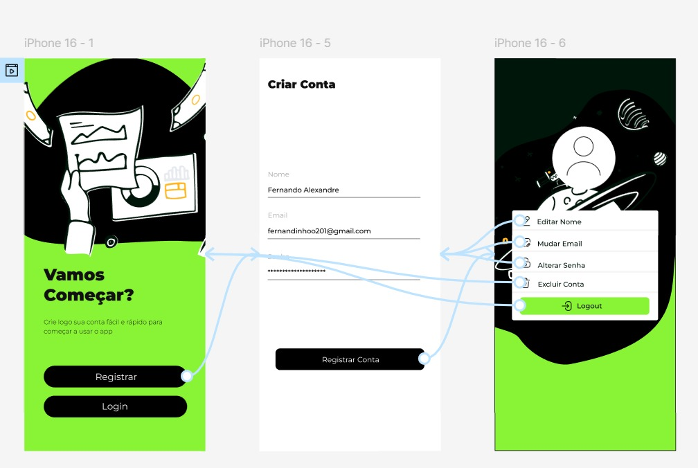

# Pagae
NOME DO SISTEMA: Pagae

OBJETIVO DO SISTEMA: Criar um aplicativo que facilite a divisão e o controle de despesas em grupo, automatizando cálculos, notificações e registros de pagamentos.

PÚBLICO-ALVO: Grupos de amigos, colegas de trabalho, famílias, repúblicas, organizadores de eventos e qualquer pessoa que compartilhe despesas regularmente.

PRINCIPAIS FUNCIONALIDADES:

- Cadastro e login de usuários.
- Registro de despesas individuais ou coletivas.
- Divisão automática de valores entre participantes.
- Registro de pagamentos feitos dentro ou fora do app.
- Notificações de pendências e lembretes automáticos.
- Relatórios detalhados de gastos e saldos.
- Suporte a múltiplos grupos/eventos simultâneos.
- Possibilidade de ajustes manuais para divisões personalizadas.

PROBLEMAS RESOLVIDOS:

- Dificuldade em calcular de forma justa a divisão de gastos entre várias pessoas.
- Esquecimento de pagamentos ou falta de controle sobre quem já pagou.
- Falta de transparência nos gastos de grupos e eventos.
- Perda de tempo com planilhas e anotações manuais.

RECURSOS DESEJADOS:

- App para Android e iOS.
- Integração com Pix, cartão de crédito e carteiras digitais.
- Exportação de relatórios em PDF/Excel.
- Notificações push e por e-mail.
- Suporte a múltiplas moedas.

PLATAFORMA: Aplicativo para usuários (Android e iOS) e painel web para administradores/organizadores.

PRAZO E EXPECTATIVAS:

- Prototipagem e validação da ideia – 3 semanas.
- Desenvolvimento do MVP – 3 a 4 meses.
- Testes com usuários reais – 2 meses.
- Lançamento da primeira versão pública – 9 a 12 meses.

Integrantes:  Felipe Corrêa, Guilherme Almeida, Lucas Villalba, Fernando Alexandre, Miguel Lima. 

# Esboço da tela principal

